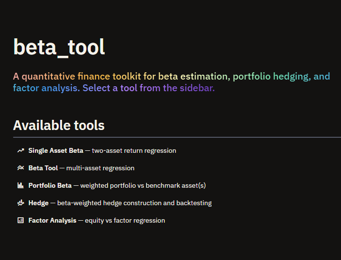
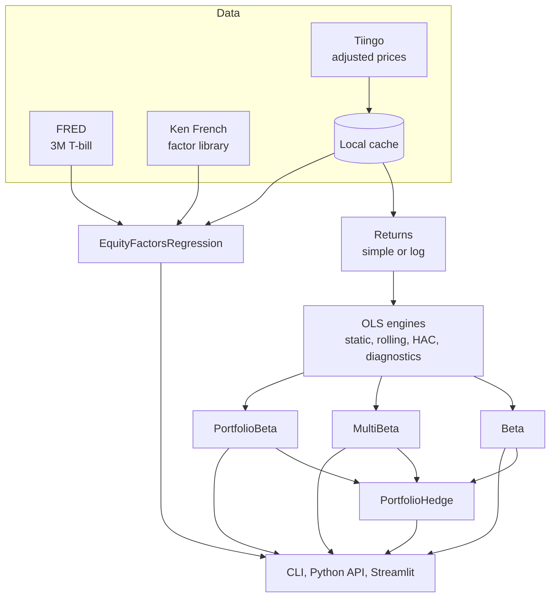

# beta-tool

> Measure how your stocks and portfolios move with the market, from one command or one web page. No Python required.

[](https://beta-tool.streamlit.app)


<!-- Add a screenshot or GIF of the web app and CLI output here, e.g.  -->


## Contents

- [What is it?](#what-is-it)
- [Get started](#get-started)
- [Using the CLI](#using-the-cli)
- [Reading your results](#reading-your-results)
- [Troubleshooting](#troubleshooting)
- [For developers](#for-developers)

---

## What is it?

`beta-tool` downloads price history, runs the statistics for you (regressions, confidence intervals, diagnostics) and hands back a clean summary and charts. You type a command or fill in a form. You never touch the code.

| Question you might ask                                            | Command         |
| ----------------------------------------------------------------- | --------------- |
| How much does MSFT move when SPY moves?                           | `beta`          |
| What mix of market, tech and bond exposure does GOOG have?        | `multibeta`     |
| What is my portfolio's beta against SPY, QQQM and AGG?            | `portfoliobeta` |
| How would hedging my portfolio have worked out historically?      | `hedge`         |
| Which style factors (size, value, profitability...) drive NVDA?   | `factors`       |

**Highlights**

- Static and rolling regressions, with log or simple returns at daily, weekly, monthly or annual frequency.
- Optional HAC (Newey-West) robust statistics and automatic diagnostic checks.
- Hedge backtests that avoid look-ahead bias, comparing hedged and unhedged risk.
- Fama-French 5-factor exposure analysis.
- Price data cached on your machine, so repeat runs are fast.

---

## Get started

Pick whichever suits you. Both give the same results.

### Option A: use the web app (nothing to install)

Open **https://beta-tool.streamlit.app**, choose a tool from the sidebar, fill in the form and read the interactive charts. Results can be downloaded as CSV and JSON.

### Option B: install the command-line tool

This takes a couple of minutes and only needs to be done once. You do **not** need to install Python yourself: the installer below fetches the right version automatically.

**1. Install `uv`** (the installer that manages everything)

PowerShell (Windows):

```powershell
irm https://astral.sh/uv/install.ps1 | iex
```

macOS / Linux:

```bash
curl -LsSf https://astral.sh/uv/install.sh | sh
```

Then open a new terminal window.

**2. Install beta-tool**

```bash
uv tool install git+https://github.com/wangjubin-06/beta-tool.git
```

This puts the `beta-tool` command on your PATH, in its own isolated environment.

**3. Add your data key**

beta-tool downloads prices from [Tiingo](https://www.tiingo.com/). Create a free account, copy your API token from your account's API page, and save it as an environment variable:

PowerShell (Windows):

```powershell
setx TIINGO_API_KEY "your-key"
```

macOS / Linux (zsh; use `~/.bashrc` if you use bash):

```bash
echo 'export TIINGO_API_KEY="your-key"' >> ~/.zshrc
```

Open a new terminal window afterwards so the change takes effect.

The `factors` command with `--factor_source etf` also needs a free [FRED](https://fred.stlouisfed.org/) API key, saved the same way as `FRED_API_KEY`. The default Fama-French mode does not.

**4. Run your first analysis**

```bash
beta-tool beta MSFT SPY --period 5y --rolling -o plots
```

A results table prints in your terminal and the charts are saved as PNG files in a `plots` folder.

### Updating and uninstalling

```bash
uv tool upgrade beta-tool
uv tool uninstall beta-tool
```

### Where your data is cached

Downloaded prices are cached in a data/ folder inside the directory you run the command from.

To reuse one cache from any folder, set `BETA_TOOL_DATA_DIR` to a fixed folder, the same way you set the API key (for example `setx BETA_TOOL_DATA_DIR "C:\beta-tool-data"` in PowerShell). It is safe to delete the folder, and it's rebuilt on the next run.

---

## Using the CLI

Five commands, one per question. Every command has `--help`.

```bash
beta-tool --help
beta-tool beta --help
```

### Examples

```bash
# How does MSFT move relative to SPY? Static and rolling beta, plots saved to ./plots
beta-tool beta MSFT SPY --period 5y --rolling -o plots

# Weekly log returns with HAC-robust statistics
beta-tool beta MSFT SPY -p 10y -f weekly -r log --hac -o plots

# One asset against several others
beta-tool multibeta GOOG -x NVDA -x AAPL -x KO --period 10y --hac -o plots

# A portfolio against several benchmarks (weights are percentages and must sum to 100)
beta-tool portfoliobeta --holding AAPL:40 --holding MSFT:35 --holding NVDA:25 -x SPY -x QQQM -x AGG -o plots

# Backtest a rolling hedge over the last 5 years
beta-tool hedge --holding NKE:20 --holding KO:20 --holding AAPL:20 --holding GOOG:20 --holding NVDA:20 -x SPY -x AGG -x QQQM --rolling --period 5y -o plots

# Backtest a static hedge over the last 5 years, estimating beta from the 126 days before the start
beta-tool hedge --holding AAPL:50 --holding MSFT:50 -x SPY --period 5y --static_lookback 126 -o plots

# Fama-French 5-factor loadings, then ETF-proxy factors with advanced output
beta-tool factors --holding NVDA --holding MSFT -f monthly
beta-tool factors --holding NVDA --factor_source etf --advanced
```

### Holdings file

Instead of repeating `--holding`, put portfolio weights in a TOML file and pass `--holdings-file holdings.toml`:

```toml
[weights]
AAPL = 40
MSFT = 35
NVDA = 25
```

### Options for `beta`, `multibeta` and `portfoliobeta`

| Option                 | Short | Default  | Description                                               |
| ---------------------- | ----- | -------- | --------------------------------------------------------- |
| `--period`             | `-p`  | `1y`     | Lookback period, e.g. `6m`, `5y`, `10y`                   |
| `--frequency`          | `-f`  | `daily`  | `daily`, `weekly` or `monthly`                            |
| `--start_date`         | `-s`  | -        | Start of observation window (`YYYY-MM-DD`)                |
| `--end_date`           | `-e`  | -        | End of observation window (`YYYY-MM-DD`)                  |
| `--return_type`        | `-r`  | `simple` | `simple` or `log`                                         |
| `--hac`                |       | off      | Use HAC-robust statistics                                 |
| `--hac_lag`            | `-hl` | auto     | Maximum HAC lag                                           |
| `--rolling`            |       | off      | Also run a rolling regression                             |
| `--rolling_window`     |       | 60       | Rolling window in observations                            |
| `--output_dir`         | `-o`  | -        | Folder for saved PNG plots                                |
| `--show`               |       | off      | Open plots in an interactive window                       |

If you pass neither `--output_dir` nor  `--show`, the tables print in your terminal and no plots are saved or shown.

### Options for `hedge`

| Option              | Short | Default    | Description                                                                 |
| ------------------- | ----- | ---------- | --------------------------------------------------------------------------- |
| `--holding`         |       | -          | `TICKER:WEIGHT` pair, repeatable. A single holding hedges one asset         |
| `--holdings-file`   |       | -          | TOML file of weights (alternative to `--holding`)                           |
| `--x-ticker`        | `-x`  | -          | Hedge instrument, repeatable                                                |
| `--period`          | `-p`  | see `--help` | Backtest window, e.g. `5y`, as an alternative to explicit dates           |
| `--frequency`       | `-f`  | `daily`    | `daily`, `weekly` or `monthly`                                              |
| `--start_date` / `--end_date` | `-s` / `-e` | - | Explicit backtest dates                                              |
| `--rolling`         | `-r`  | off        | Use a rolling hedge ratio (otherwise static)                                |
| `--rolling_window`  | `-rw` | by frequency | Lookback for the rolling regression                                       |
| `--rebalance`       |       | window ÷ 6 | Observations between hedge-ratio updates                                    |
| `--static_lookback` | `-sl` | by frequency | Beta lookback for a static hedge (cannot be combined with `--rolling`)    |
| `--output_dir` / `--show` | `-o` | -    | Save or display the plots                                                   |

If you pass neither `--output_dir` nor  `--show`, the tables print in your terminal and no plots are saved or shown.

### Options for `factors`

| Option            | Short | Default  | Description                                                |
| ----------------- | ----- | -------- | ---------------------------------------------------------- |
| `--holding`       |       | -        | Ticker to analyse, repeatable                              |
| `--factor_source` | `-fs` | `french` | `french` (Fama-French 5) or `etf` (unofficial ETF proxies) |
| `--start_date`    | `-s`  | -        | Start of the regression window                             |
| `--end_date`      | `-e`  | -        | End of the regression window                               |
| `--return_type`   | `-r`  | `simple` | `simple` or `log`                                          |
| `--frequency`     | `-f`  | `daily`  | `daily`, `monthly` or `annually`                           |
| `--advanced`      | `-a`  | off      | Also print the full statistical summaries                  |

### What you get

- **Static table**: window, frequency, return type, HAC settings, beta, alpha (and annualised alpha), R², p-values, t-stats, standard errors, 95% confidence intervals, observations and residual volatility.
- **Rolling table** (with `--rolling`): the current beta with its confidence interval and significance, alpha, R², plus the mean, median, min, max and standard deviation of the rolling beta.
- **Diagnostic checks** when HAC is off.
- **Charts** saved as 150 dpi PNGs in your `--output_dir`, for example `MSFT_SPY_static_plot.png` and `MSFT_SPY_rolling_60_plot.png`.

---

## Reading your results

| Number               | What it tells you                                                                                       |
| -------------------- | ------------------------------------------------------------------------------------------------------- |
| **Beta**             | How much the first asset tends to move for each 1% move in the second. 1.0 moves in step, above 1 amplifies, between 0 and 1 dampens, below 0 moves the opposite way |
| **Alpha**            | Average return left over after accounting for beta. It is per period, so use the annualised figure to compare across frequencies |
| **R-squared**        | The share of the asset's ups and downs explained by the other asset(s). Higher means the beta is more informative |
| **p-value**          | How likely a beta this far from zero is by chance. Below 0.05 is the usual bar for "statistically significant" |
| **95% CI**           | The range the true beta plausibly sits in. A wide range means a noisy estimate                          |
| **Residual volatility** | How much of the asset's movement is *not* explained by the model                                     |

Betas are **historical estimates**. They change with the window, the frequency and the benchmark you pick, so treat them as a guide rather than a prediction.

---

## Troubleshooting

| What you see                                       | What it means and what to do                                                                 |
| -------------------------------------------------- | -------------------------------------------------------------------------------------------- |
| `command not found` or `not recognized`            | Open a new terminal. If it persists, run `uv tool update-shell` and open another one         |
| Tiingo API key not found                           | `TIINGO_API_KEY` is not set. Follow step 3 above, then open a new terminal                   |
| Tiingo rejected your API key                       | The key is wrong or inactive. Copy it again from your Tiingo account                         |
| No data for a ticker                               | Check the spelling. Tiingo covers US-listed securities, so other markets may not work        |
| Rate limit reached                                 | Free accounts have request limits. Wait a while, or analyse fewer tickers at once            |
| Error mentioning FRED                              | You used `--factor_source etf` without a `FRED_API_KEY`. Add one, or use the default `french` |
| Weights must sum to 100                            | Portfolio weights are percentages, so `AAPL:40 MSFT:35 NVDA:25` works and `0.4 0.35 0.25` does not |

Still stuck? Open an issue on GitHub with the command you ran and the message you saw.

---

## For developers

Everything above is a thin layer over a Python library. If you want to extend it, script it or run the web app locally, this section is for you.

### Set up from source

Requires **Python 3.12+** and [uv](https://docs.astral.sh/uv/).

```bash
git clone https://github.com/wangjubin-06/beta-tool.git
cd beta-tool

uv sync                # core library + CLI

uv run beta-tool --help
uv run streamlit run src/beta_tool/webapp/app.py
```

Prefer pip? `pip install -e .` works too. From source, export `TIINGO_API_KEY` (and `FRED_API_KEY` for the ETF factor mode) in your shell as described in step 3 above.

### The five tools

| Tool                      | What it does                                                          | Rolling       | HAC |
| ------------------------- | --------------------------------------------------------------------- | ------------- | --- |
| `Beta`                    | Regresses one asset's returns on another's                            | Yes           | Yes |
| `MultiBeta`               | Regresses one asset on N assets simultaneously                        | Yes           | Yes |
| `PortfolioBeta`           | Regresses a weighted portfolio on one or several assets               | Yes           | Yes |
| `PortfolioHedge`          | Backtests a static or rolling beta hedge for an asset or a portfolio  | Rolling hedge | No  |
| `EquityFactorsRegression` | Decomposes returns into Fama-French 5 (or ETF-proxy) factor loadings  | No            | Yes |

### Python API

```python
from beta_tool import Beta, MultiBeta, PortfolioBeta, PortfolioHedge, EquityFactorsRegression
```

**Two-asset beta, static and rolling**

```python
beta = Beta("msft", "spy", period="5y", frequency="daily", return_type="simple", hac=True)

beta.summary()                      # printed regression summary
results = beta.get_static_results() # dict: beta, alpha, r_squared, beta_pvalue, beta_ci_low, ...
fig = beta.plot_results()           # prices, return distributions, Q-Q plots and OLS scatter

beta.historical_rolling_beta(window=60)
beta.rolling_beta_summary()
fig = beta.rolling_beta_plot()
```

**One asset against several**

```python
mb = MultiBeta("goog", ["nvda", "aapl", "ko"], period="10y", hac=True)
mb.summary()
```

**Portfolio against benchmarks** (weights are percentages and must sum to 100)

```python
pb = PortfolioBeta(
    {"aapl": 40, "msft": 35, "nvda": 25},
    asset_to_be_regressed=["spy", "qqqm", "agg"],
    period="10y",
)
pb.summary()
```

**Hedge backtest**

```python
hedge = PortfolioHedge(
    target={"nke": 20, "ko": 20, "aapl": 20, "goog": 20, "nvda": 20},
    hedge_instruments=["spy", "agg", "qqqm"],
    backtest_start_date="2018-09-09",
    backtest_end_date="2025-09-09",
    frequency="daily",
    hedge_type="rolling",
)

fig = hedge.backtest(plot=True)
hedge.metrics_df      # hedged vs unhedged risk metrics
hedge.latest_beta     # most recent hedge ratio(s)
```

**Factor exposures**

```python
fac = EquityFactorsRegression(factor_source="french", frequency="monthly")
fac.asset_list("nvda", "msft")
fac.regress()          # run this first
fac.results()          # factor loadings with t-stats, p-values, CIs and plain-English notes
fac.advanced_results() # full statsmodels summaries
```

### Tool reference

#### `Beta`, `MultiBeta` and `PortfolioBeta`

The three regression tools share their parameters and methods.

| Parameter       | `Beta`   | `MultiBeta` | `PortfolioBeta`         | Description                                                          |
| --------------- | -------- | ----------- | ----------------------- | -------------------------------------------------------------------- |
| Dependent (y)   | `asset1` | `asset1`    | `portfolio_dic`         | Ticker, or for a portfolio a `{ticker: percent}` dict summing to 100 |
| Independent (x) | `asset2` | `assets`    | `asset_to_be_regressed` | One ticker (`Beta`), a list (`MultiBeta`), or a ticker or list (`PortfolioBeta`, default `"spy"`) |
| `period`        | `"1y"`   | `"1y"`      | `"10y"`                 | Lookback period                                                      |
| `frequency`     | `"daily"`| `"daily"`   | `"daily"`               | `daily`, `weekly`, `monthly` or `annually`                           |
| `start_date`, `end_date` | `None` | `None` | `None`               | `YYYY-MM-DD` strings                                                 |
| `return_type`   | `"log"`  | `"log"`     | `"simple"`              | `"log"` or `"simple"`                                                |
| `hac`           | `False`  | `False`     | `False`                 | Use Newey-West HAC standard errors                                   |
| `hac_lag`       | `None`   | `None`      | `None`                  | Max lag; auto is 3 (1 for annual data)                               |

Note that the Python API defaults to log returns for `Beta` and `MultiBeta`, while the CLI defaults to simple returns.

| Method                               | Purpose                                                           |
| ------------------------------------ | ----------------------------------------------------------------- |
| `summary()`                          | Print the regression summary (and diagnostics when HAC is off)    |
| `get_static_results()`               | Static statistics as a dict                                       |
| `get_static_beta()`                  | Static beta(s)                                                    |
| `plot_results()`                     | Static regression plots                                           |
| `historical_rolling_beta(window=60)` | Run the rolling regression                                        |
| `rolling_beta_summary()`             | Print rolling-beta statistics                                     |
| `get_rolling_results()`              | Rolling statistics as a dict                                      |
| `get_rolling_beta()`                 | Rolling beta series                                               |
| `rolling_beta_plot()`                | Rolling beta chart                                                |

`PortfolioBeta.plot_results()` is only available when regressing against a single asset. Duplicate tickers in a portfolio dict are merged, and duplicate factors in `MultiBeta` are removed.

#### `PortfolioHedge`

| Parameter                | Default       | Description                                                                              |
| ------------------------ | ------------- | ---------------------------------------------------------------------------------------- |
| `target`                 | required      | A ticker, or a `{ticker: percent}` dict for a portfolio                                  |
| `hedge_instruments`      | `"spy"`       | A ticker or list of tickers to hedge with                                                |
| `backtest_start_date`, `backtest_end_date` | `None` | `YYYY-MM-DD`; the end date is exclusive                                      |
| `backtest_period`        | `None`        | `1m`, `3m`, `6m`, `1y`, `2y`, `3y`, `5y`, `10y`, `20y`, `30y`. Overrides the dates       |
| `frequency`              | `"daily"`     | `daily`, `weekly` or `monthly`                                                           |
| `return_type`            | `"simple"`    | Only `"simple"` is supported                                                             |
| `hedge_type`             | `"static"`    | `"static"` or `"rolling"`                                                                |
| `window`                 | by frequency  | Rolling regression lookback. Default 126 / 52 / 24 for daily / weekly / monthly; minimum 30 / 20 / 12 |
| `rebalance_freq`         | `window // 6` | Observations between hedge-ratio updates (rolling only)                                  |
| `static_lookback_window` | by frequency  | Lookback before the backtest start used to estimate a static beta; same defaults and minimums as `window`, measured in calendar days, weeks or months |

`backtest(plot=False)` runs the simulation and returns a figure (or `None`). Afterwards, `metrics_df` and `hedge_df` hold the risk-metric tables, `latest_beta` holds the current hedge ratio(s), and `backtest_plot()` returns `(fig, axes)`. Rolling hedges also expose `rolling_beta_df`.

#### `EquityFactorsRegression`

| Parameter       | Default    | Description                                                                         |
| --------------- | ---------- | ----------------------------------------------------------------------------------- |
| `factor_source` | `"french"` | `"french"` for Fama-French 5, `"etf"` for ETF proxies                               |
| `start_date`, `end_date` | `None` | `YYYY-MM-DD`; defaults to the longest common history                             |
| `return_type`   | `"simple"` | `"simple"` or `"log"`                                                               |
| `frequency`     | `"daily"`  | `daily`, `monthly` or `annually`                                                    |
| `hac`           | `None`     | `"auto"` or an integer number of lags                                               |

Methods: `asset_list(*tickers)`, `regress()`, `results()`, `advanced_results()`, `reset_assets()` and `help()`.

| Factor        | Fama-French source | ETF-proxy source        |
| ------------- | ------------------ | ----------------------- |
| Market        | Mkt-RF             | SPY minus risk-free     |
| Size          | SMB                | IWM minus SPY           |
| Value         | HML                | IWD minus IWF           |
| Profitability | RMW                | QUAL minus SPY          |
| Investment    | CMA                | not included            |
| Momentum      | not included       | MTUM minus SPY          |

The risk-free rate is the French RF series for Fama-French mode and the FRED 3-month T-bill (`DGS3MO`) for ETF mode. The ETF-proxy regression is a convenience approximation and is **not** the true Fama-French model.

### Methodology

**Regression models**

```
Beta / PortfolioBeta (one x):    r_y,t = α + β · r_x,t + ε_t
MultiBeta / PortfolioBeta (N x): r_y,t = α + Σ_j β_j · r_xj,t + ε_t
Factors:                         r_i,t − rf_t = α + Σ_k β_k · F_k,t + ε_t
```

For a portfolio, `r_y,t` is the weighted sum of its assets' simple returns. Prices are adjusted closes, and returns from different assets are aligned with an inner join on date.

**Returns.** Simple returns are `P_t / P_{t-1} − 1`; log returns are `ln(P_t / P_{t-1})`. In factors mode with log returns, the French factors (which are published as simple returns) are converted with `log(1 + r)`.

**HAC / Newey-West.** HAC changes standard errors, p-values and confidence intervals but leaves the coefficient estimates unchanged. It is a common defensive default for daily financial returns. When it is off, residual diagnostics are printed instead.

**Rolling beta.** A fixed-window rolling OLS with a default window of 60 observations for the regression tools.

**Hedging**

- Hedged return: `r_target,t − Σ_j β_j · r_hedge_j,t`, built from **simple** returns because they aggregate linearly across assets at a point in time.
- **Static hedge**: beta is estimated only from data in the lookback window ending at the backtest start, then held fixed, so the backtest never sees the future.
- **Rolling hedge**: the hedge ratio applied on day *t* is the rolling beta from day *t−1*, refreshed every `rebalance_freq` observations and held piecewise-constant in between.
- The unhedged portfolio is buy-and-hold: units are bought at the start (index = 100) and never rebalanced.

### Architecture



The CLI and web layers are adapters: presentation logic lives there, and the core classes are never modified to suit them. Data-access failures (missing or invalid API key, unknown ticker, rate limit) are raised as `DataError` subclasses, and the CLI prints them as plain messages instead of tracebacks.

| Module                | Contents                                                                                     |
| --------------------- | -------------------------------------------------------------------------------------------- |
| `beta.py`, `multibeta.py`, `portfoliobeta.py` | The three regression tools                                          |
| `regression.py`       | `OLSRegression` and `MultiFactorRegression`: static and rolling OLS, HAC, result dictionaries |
| `returns.py`          | `log_returns` and `simple_returns`                                                           |
| `diagnostics.py`      | Heteroskedasticity, autocorrelation, normality and multicollinearity checks                  |
| `plotting.py`         | Price, return-distribution, Q-Q, OLS and coefficient plots                                   |
| `data.py`             | `AssetData`, the price-data entry point                                                      |
| `data_collection/`    | `TiingoApi`, `FredApi` and `FrenchApi` clients, plus the `DataError` types                   |
| `portfolio_hedger.py` | `PortfolioHedge`                                                                             |
| `metrics.py`          | `calculate_risk_metrics` for hedged vs unhedged comparison                                   |
| `factorsregression.py`, `factorresults.py` | `EquityFactorsRegression` and its result formatting                     |
| `cli.py` modules      | Typer commands `beta`, `multibeta`, `portfoliobeta`, `hedge`, `factors`                       |
| `webapp/`             | Streamlit app                                                                                |

### Notes and limitations

- **Betas are historical estimates.** They depend on the window, sampling frequency and benchmark you choose. A wide confidence interval or low R² means the number is noisy.
- **French factors are US factors.** Use them for US equities only. The most recent months may not yet be published.
- **ETF-proxy factors are approximations**, and momentum replaces the investment factor in that mode.
- **Hedge backtests are simplified**: no transaction costs, slippage, borrow or financing, and the risk-free rate is set to zero in the risk metrics.
- **Portfolio construction differs slightly by tool.** `PortfolioBeta` weights each period's asset returns, while `PortfolioHedge` tracks a buy-and-hold portfolio.
- **Static hedge lookbacks are measured in calendar time** (days, weeks or months before the backtest start), not in trading observations.
- **Weekly data is not supported for factor regressions.**
- **Internet access and API keys are required** for data that is not already cached.

### Roadmap

- `pytest` test suite
- Kalman-filter time-varying beta
- Rolling factor-stability panel
- Scenario and stress tests using factor-beta dot products

---

## Disclaimer

This project is for educational and research purposes only and is not investment advice.